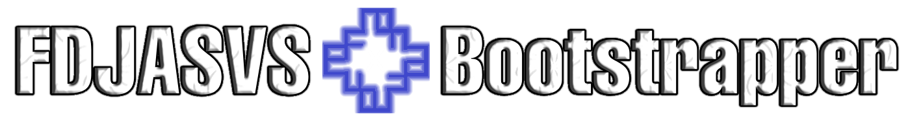

# 🔥FDJASVS X Bootstrapper🔥

  **FDJASVS X Bootstrapper** - A ROBLOX Modification Application That Saves your changes Everytime ROBLOX updates.

  If you're a newbie, consider checking out The Massive Documentation. In Case of any other troubleshooting, you can either Start A Discussion over On The Discussions Page. Or submit an issue Over on the issues Page, Please However Read The Issue Guide Before Doing So.

## 📝Credits📝

[Bloxstrap](https://github.com/bloxstraplabs) - Inspiration

## ⚠️For Clarification⚠️
- Using FDJASVS X Bootstrapper will NOT get you banned as long as you do not use any of the hacking presets or change the ROBLOX Download Channel.
  - We also do NOT encourage you to use any of the hacking presets, if you do wanna use them, do it at Your Own Risk.
- FDJASVS X Bootstrapper is NOT and will NOT be malware, We just want to offer you features that Bloxstrap doesn't.
  - BloxInstaller Is Also Safe. It Is Closed-Source, But You can Check FDJASVS X Bootstrapper's Source Code to see what commands does It Execute(search up `EmeraldGG` in the search bar) 
- To Enable Developer Mode, Click The Wrench Icon In FDJASVS X Bootstrapper's Main Window
  - I'd Also Like To Point Out That You Should Use Developer Mode With Caution, Some Of The Features In It Can Get You Banned. Have Fun! 
- Unfortunately, FDJASVS X Bootstrapper only Works on Windows and does not offer Support for MacOS, Linux Or Any Other Operating System. Apologies to any non-windows user out there.

## 🤩TOP FEATURES🤩
- Multi-Instance Launching
   - Allows You To Launch Multiple Roblox Instances, Taking Ownership Of Their Mutex.
- Change Channel[Developer Mode]
   - With this feature, you can now change The ROBLOX Download Channel[RISKY]
