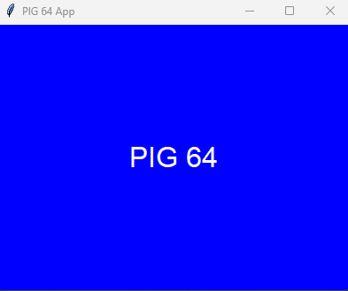
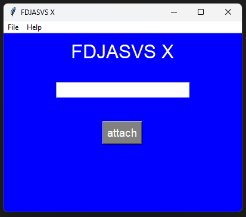
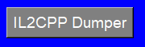
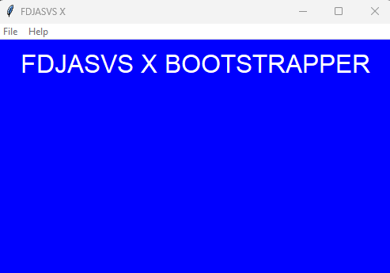

## Credits

[Bloxstrap](https://github.com/bloxstraplabs) - Inspiration

[Flikter](https://github.com/Flikter) - [Multiple-Roblox-Instances](https://github.com/Flikter/Multiple-Roblox-Instances)

# The Story Behind FDJASVS X Bootstrapper

**PIG 64(Where FDJASVS X Really Originated)**

As You may or may not know, I Am A Huge Fan Of The Hit Roblox experience Called "Piggy".

Well, an hour before the release of "PIG 64" - A Piggy Game Inspired By Super Mario 64. I decided to tell ChatGPT to write Me a Python app that looked like this:

## How It All Started...
So, I was trolling one of my friends with a "FDJASVS X" - A Fake Executor written in Python By ChatGPT and It Looked like This: 

At that time, I didn't really think much of It as It was just a prank. But because I had joy of making It, I added more _"features"_.

A few days later though, FDJASVS X Premium Was Born. With new _"features"_ like:

It's kinda obvious the "features" are fake lol, yet he still fell for it

## The Website And The Origin Of FDJASVS X Bootstrapper

### The Website

Whenthe FDJASVS X Idea Was Born, I talked with one of my friends(Co-Founder Of FDJASVS X Bootstrapper) if We should create a website to troll one of my friends even more and he said yes. Tho That Idea Got Scrapped cause I Know nothing about HTML And ChatGPT Just Kept fucking up The Job.

**HOWEVER...**

### The Origin Of FDJASVS X Bootstrapper

Whenthe Website Was Being Created, I told Emerald(Co-Founder Of FDJASVS X Bootstrapper) The Following:
"IK WHAT I'LL DO"
"I'LL MAKE A FDJASVS X BOOTSTRAPPER PLAN"
_...but this time_
I Wanted To Make An Actual Bootstrapper, That Would Actually Inject Flags etc.
and here it is lol:

After Emerald Saw That Picture Though, He Said He'll Make It For Me In C# And So He Got To Work.

(i don't have any FDJASVS X Bootstrapper V2 images unfortunately)

Shame For Me, Emerald Was Unfortunately Way Too Busy To Keep Working On FDJASVS X Bootstrapper, But Because I Didn't Want To Discontinue The Project So I Did This...

# FDJASVS X Bootstrapper V3

When Emerald Was Busy With other stuff, I Decided That I'll Try Making FDJASVS X Bootstrapper Myself, which wasn't Really A Success cause I was only Good at making the UI's.

So Unfortunately, I Had To Discontinue FDJASVS X Bootstrapper.

**2 Months Later...**

At the end of Summer, Emerald finally Found Time To Help Me With FDJASVS X Bootstrapper, And Here We Are! 

Introducing...

# The Story Behind FDJASVS X Studio

So for a few months now, I've been struggling with the fact that sometimes, Roblox Studio just Didn't Run For Me, It annoyed Me For Long enough. So I took matters Into My Own Hands. If you Also Have The Same issue As Me, feel free To Use This To Boot Roblox Studio Without The Struggle Of Re-Installing It.

Introducing...

# FDJASVS X Studio
